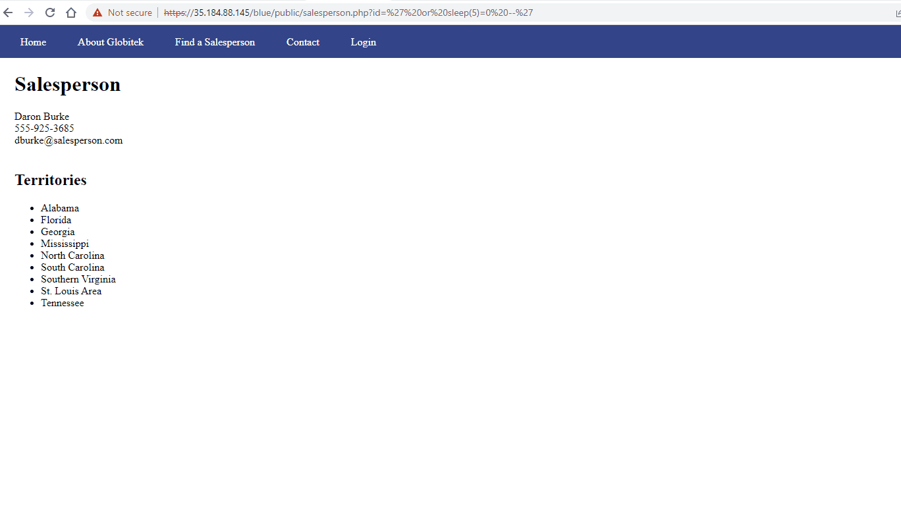
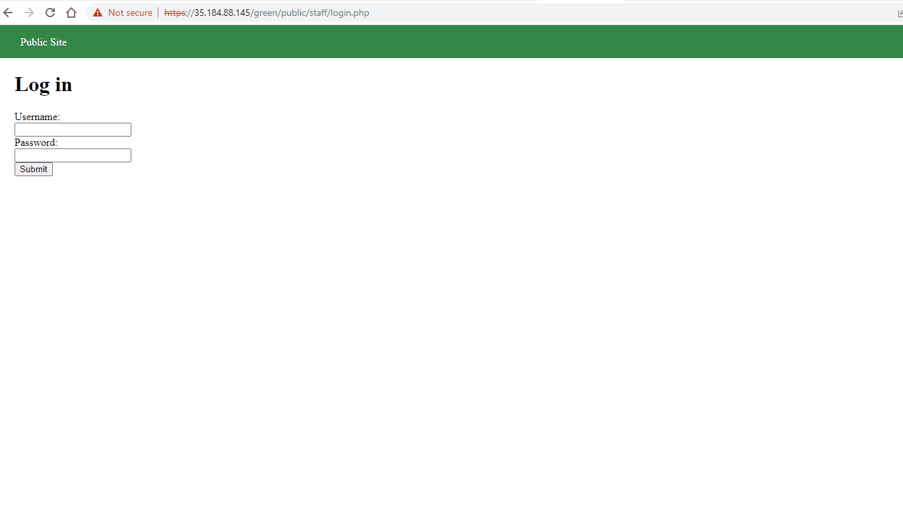
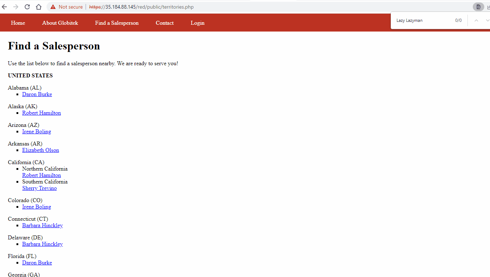

# Project 9 - Pentesting Live Targets

Time spent: **X** hours spent in total

> Objective: Identify vulnerabilities in three different versions of the Globitek website: blue, green, and red.

The six possible exploits are:

* Username Enumeration
* Insecure Direct Object Reference (IDOR)
* SQL Injection (SQLi)
* Cross-Site Scripting (XSS)
* Cross-Site Request Forgery (CSRF)
* Session Hijacking/Fixation

Each color is vulnerable to only 2 of the 6 possible exploits. First discover which color has the specific vulnerability, then write a short description of how to exploit it, and finally demonstrate it using screenshots compiled into a GIF.

## Blue

Vulnerability #1: SQL injection

Description:
By editing the 'id' parameter in url, the website will redirect to the page of corresponding salesperson. 
If the 'id' parameter is changed to:
?id=' or 1=1'--
It redirects to "Database query failed", which means it is vulnearable for SQL injection.
For example, if the id is changed to:
?id=' or SLEEP(50000)=0 --'
Then, the server will hang for 50000 seconds under the attack.

## Green

Vulnerability #1: Username Enumeration

Description:
If an incorrect username is entered, it will return a message: 'Log in was unsuccessful'.
If an existing username is entered with wrong password, it will also shows a message of 'Log in was unsuccessful' but in bold.
Attackers can brute force a range of usernames to find out a list of usernames under this vulnearbility.

## Red

Vulnerability #1: IDOR

Description:
By editing the 'id' parameter in url, the website will redirect to the page of corresponding salesperson. 
If the 'id' parameter is changed to:
?id=11
It will shows a hidden salesperson which is not available in the menu page. Internal data is leaked under IDOR attack.

## Notes

Describe any challenges encountered while doing the work
